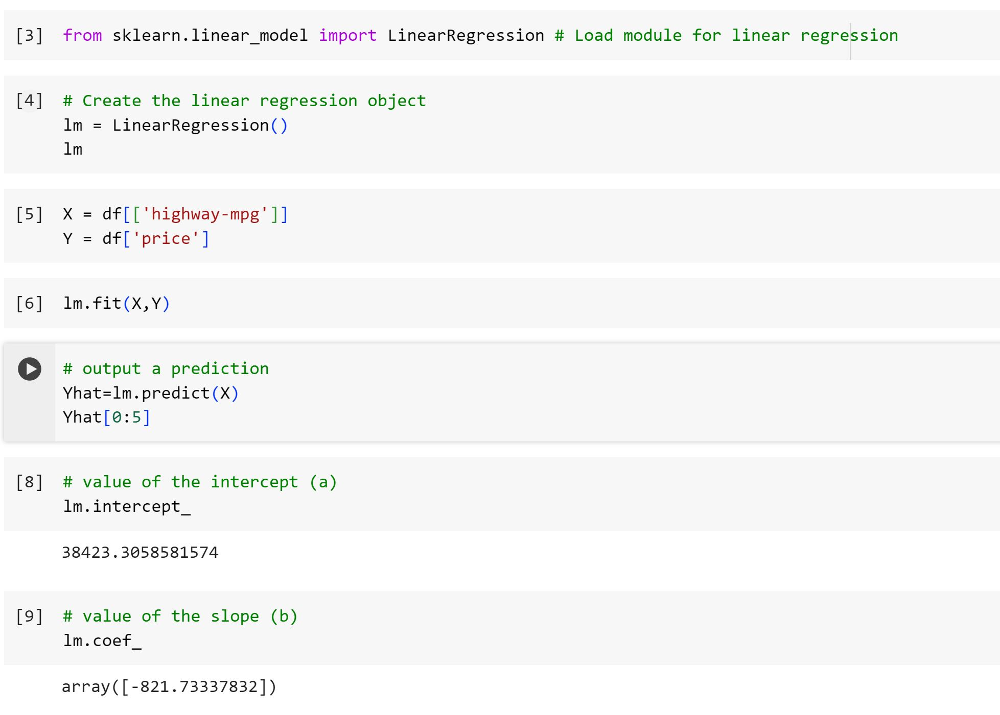
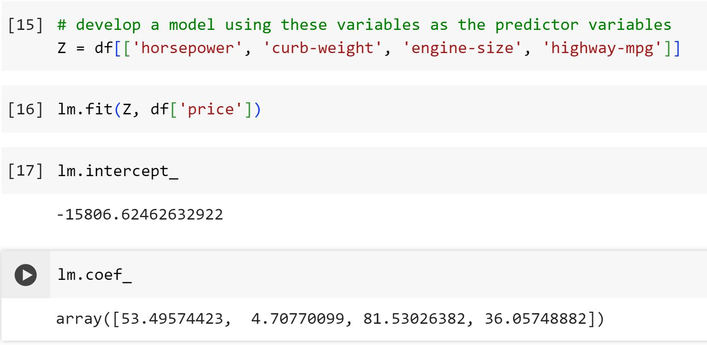

# Predictive-Model-Development-with-Python

**Note:** ***This is a followup on my github repository ["Exploratory Data Analysis with Python"](https://github.com/Henryzeze/Exploratory-Data-Analysis-with-Python)***

## Objectives

The primary goal of this section is to develop predictive models for estimating the price of a car using its variables or features. While the predictions are estimations, they provide an objective idea of the approximate value a car should hold.

**Key Questions Addressed:**

1. Evaluating fairness in the dealer's offer for a trade-in vehicle.
2. Determining a reasonable valuation for a car.

In the realm of data analytics, Model Development plays a crucial role in predicting future observations based on existing data. Models aid in comprehending the intricate relationships among different variables and how these variables contribute to predicting outcomes.

### 1. Linear Regression and Multiple Linear Regression

#### Linear Regression

Linear Regression involves using a data model, such as Simple Linear Regression, to comprehend the relationship between two key variables:

1. The predictor or independent variable (X)
2. The response or dependent variable (Y) that we aim to predict

The outcome of Linear Regression is a linear function that forecasts the response variable based on the predictor variable.

**Linear Function**

The linear function is represented by:

$$
Yhat = a + b  X
$$

.
**a:** It denotes the intercept of the regression line, signifying the value of Y when X equals 0.

**b:** It denotes the slope of the regression line, illustrating how Y changes as X increases by 1 unit.

The linear regression model aids in understanding how changes in the predictor variable are associated with alterations in the response variable, providing insights into their relationship.

lets take a look at how highway-mpg can help us predict car price. Using simple linear regression, we will create a linear function with "highway-mpg" as the predictor variable and the "price" as the response variable. 

A final linear model with the structure:

$$
Yhat = a + b  X
$$

.
Plugging in the actual values gives:

**Price** = 38423.31 - 821.73 x **highway-mpg**

#### Multiple Linear Regression

When we aim to predict car prices using more than one variable, we resort to Multiple Linear Regression. This method, akin to Simple Linear Regression, delves into the relationship between a continuous response variable (dependent) and two or more predictor variables (independent). In practical applications, many regression models involve multiple predictors, contributing to a more comprehensive understanding of the relationship between variables.

**The Equation**

The equation for Multiple Linear Regression can be represented as follows:

$$
Yhat = a + b_1 X_1 + b_2 X_2 + b_3 X_3 + b_4 X_4
$$

.
In our context, potential influential predictors for car price include:

- Horsepower
- Curb-weight
- Engine-size
- Highway-mpg

We'll construct a predictive model leveraging these variables as predictors, aiming to unveil how they collectively contribute to estimating car prices.

A final linear function with the structure:

$$
Yhat = a + b_1 X_1 + b_2 X_2 + b_3 X_3 + b_4 X_4
$$

.
Plugging in the actual values gives:

**Price** = -15678.742628061467 + 52.65851272 x **horsepower** + 4.69878948 x **curb-weight** + 81.95906216 x **engine-size** + 33.58258185 x **highway-mpg**

