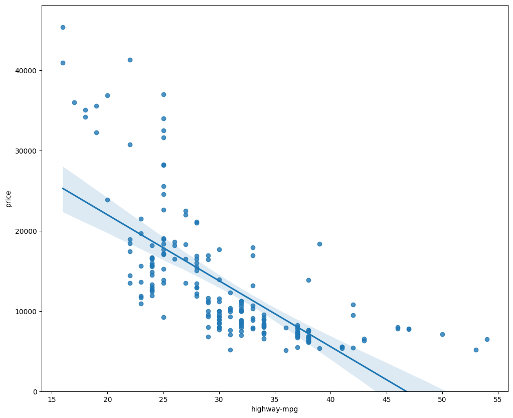
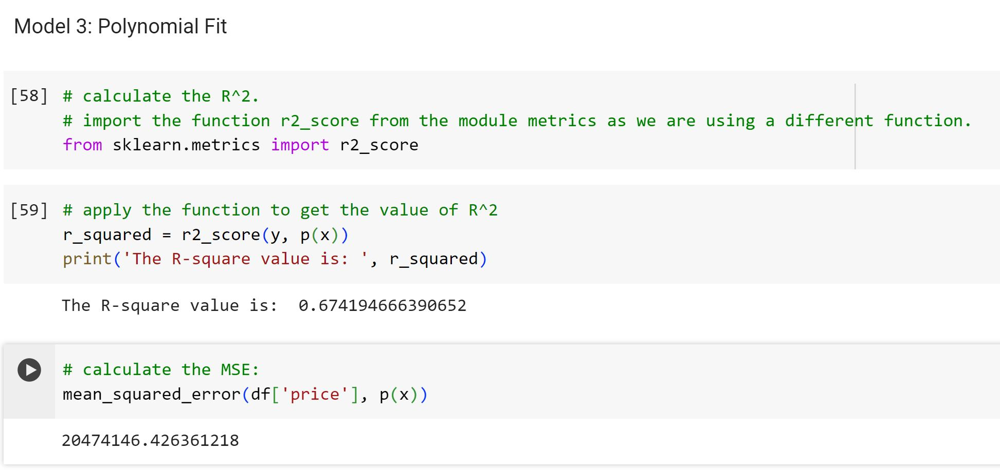
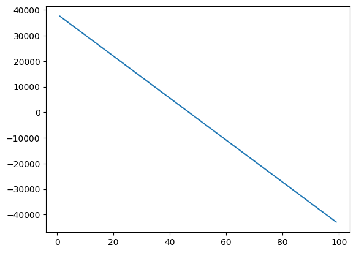

# Predictive-Model-Development-with-Python

**Note:** ***This is a followup on my github repository ["Exploratory Data Analysis with Python"](https://github.com/Henryzeze/Exploratory-Data-Analysis-with-Python)***

## Objectives

The primary goal of this section is to develop predictive models for estimating the price of a car using its variables or features. While the predictions are estimations, they provide an objective idea of the approximate value a car should hold.

**Key Questions Addressed:**

1. Evaluating fairness in the dealer's offer for a trade-in vehicle.
2. Determining a reasonable valuation for a car.

In the realm of data analytics, Model Development plays a crucial role in predicting future observations based on existing data. Models aid in comprehending the intricate relationships among different variables and how these variables contribute to predicting outcomes.

### 1. Linear Regression and Multiple Linear Regression

#### Linear Regression

Linear Regression involves using a data model, such as Simple Linear Regression, to comprehend the relationship between two key variables:

1. The predictor or independent variable (X)
2. The response or dependent variable (Y) that we aim to predict

The outcome of Linear Regression is a linear function that forecasts the response variable based on the predictor variable.

**Linear Function**

The linear function is represented by:

$$
Yhat = a + b  X
$$

.
**a:** It denotes the intercept of the regression line, signifying the value of Y when X equals 0.

**b:** It denotes the slope of the regression line, illustrating how Y changes as X increases by 1 unit.

The linear regression model aids in understanding how changes in the predictor variable are associated with alterations in the response variable, providing insights into their relationship.

lets take a look at how highway-mpg can help us predict car price. Using simple linear regression, we will create a linear function with "highway-mpg" as the predictor variable and the "price" as the response variable. 

A final linear model with the structure:

$$
Yhat = a + b  X
$$

.
Plugging in the actual values gives:

**Price** = 38423.31 - 821.73 x **highway-mpg**

#### Multiple Linear Regression

When we aim to predict car prices using more than one variable, we resort to Multiple Linear Regression. This method, akin to Simple Linear Regression, delves into the relationship between a continuous response variable (dependent) and two or more predictor variables (independent). In practical applications, many regression models involve multiple predictors, contributing to a more comprehensive understanding of the relationship between variables.

**The Equation**

The equation for Multiple Linear Regression can be represented as follows:

$$
Yhat = a + b_1 X_1 + b_2 X_2 + b_3 X_3 + b_4 X_4
$$

.
In our context, potential influential predictors for car price include:

- Horsepower
- Curb-weight
- Engine-size
- Highway-mpg

We'll construct a predictive model leveraging these variables as predictors to unveil how they collectively contribute to estimating car prices.

A final linear function with the structure:

$$
Yhat = a + b_1 X_1 + b_2 X_2 + b_3 X_3 + b_4 X_4
$$

.
Plugging in the actual values gives:

**Price** = -15678.742628061467 + 52.65851272 x **horsepower** + 4.69878948 x **curb-weight** + 81.95906216 x **engine-size** + 33.58258185 x **highway-mpg**

### Evaluating Models Through Visualization

After constructing models, how do we assess and select the best one? Visualization plays a crucial role in this process.

Let's begin by importing the visualization package, seaborn:

**Regression Plot**

For a simple linear regression, one effective method to evaluate our model's fit is through regression plots.

These plots depict scattered data points (scatterplot) and the linear regression line fitted through the data. They provide insight into the relationship between variables, showcasing the correlation's strength and direction (positive or negative).

Let's visualize how highway-mpg potentially predicts car prices:

From this plot, it's evident that price exhibits a negative correlation with highway-mpg as the regression slope is negative.

When observing a regression plot, it's important to note the scatter of data points around the regression line. This indicates the variance within the data and helps determine if a linear model is an ideal fit. If data points are considerably distant from the line, a linear model might not suit this dataset adequately.

Let's compare this plot with the regression plot of "peak-rpm".

When comparing the regression plots of "peak-rpm" and "highway-mpg", it's observable that "highway-mpg" points are more tightly grouped around the generated line and, on average, exhibit a decreasing trend. In contrast, "peak-rpm" points show more dispersion around the predicted line, making it challenging to ascertain if the points ascend or descend with increasing "peak-rpm".

This approach aids in visually assessing the model's fit, determining the relationship between variables, and identifying which predictors might yield a better model for predicting car prices.

**Residual Plots**

A valuable approach to gauging data variance is through a residual plot.

Residuals (e) represent the discrepancy between the observed value (y) and the predicted value (Yhat) in a regression analysis. In a regression plot, the residual is the distance between a data point and the fitted regression line.

Residual plots visualize residuals along the vertical y-axis and the independent variable along the horizontal x-axis.

Considerations when analyzing a residual plot:

- Residual Spread: If residuals on the plot are randomly dispersed around the x-axis, it implies suitability for a linear model.
  Reasoning: Randomly scattered residuals signify constant variance, indicating that a linear model fits the data well.

Upon examining this residual plot, it's noticeable that residuals do not display random dispersion around the x-axis. This observation suggests that a non-linear model is more fitting for this dataset.

This analysis through residual plots aids in evaluating the appropriateness of the model and provides cues for selecting an optimal model type for the data at hand.

#### Visualizing Multiple Linear Regression

When dealing with Multiple Linear Regression, visualizing the model becomes more intricate as it cannot be directly visualized using regression or residual plots.

One way to assess the model's fit is through a distribution plot. This involves comparing the distribution of predicted values derived from the model against the distribution of actual values.

Let's begin by making predictions:

Upon examining the distribution plots, it's apparent that the fitted values exhibit a reasonable proximity to the actual values. The overlapping regions between the two distributions indicate a degree of similarity. However, there remains some scope for enhancing the model's accuracy and precision.

This method of comparing distributions provides a visual insight into how well the predicted values align with the actual values, offering a means to assess the model's performance.

### Polynomial Regression and Pipelines

Polynomial regression serves as a specialized case within the broader spectrum of linear regression models, allowing for the exploration of non-linear relationships among variables. This approach involves incorporating higher-order terms or squared forms of predictor variables.

Various orders of polynomial regression exist, offering flexibility in modeling intricate relationships.

<b>Quadratic - 2nd Order</b>

$$
Yhat = a + b_1 X +b_2 X^2 
$$

.

<b>Cubic - 3rd Order</b>

$$
Yhat = a + b_1 X +b_2 X^2 +b_3 X^3\\\\
$$

.

<b>Higher-Order</b>:

$$
Y = a + b_1 X +b_2 X^2 +b_3 X^3 ....\\
$$

.

Previously, our attempt with a linear model using "highway-mpg" as the predictor didn't yield the most optimal fit. Let's explore the potential for a polynomial model to better capture the data pattern.

To achieve this, we'll utilize a polyfit function for data visualization, gather the necessary variables, apply the polyfit function to fit the polynomial, followed by the poly1d function to display the polynomial equation.

Upon plotting the function:

It's evident from the plot that the polynomial model outperforms the linear model. This improvement is discernible as the generated polynomial function aligns more closely with the data points.

The analytical expression for Multivariate Polynomial function gets complicated. For example, the expression for a second-order (degree=2) polynomial with two variables is given by:

$$
Yhat = a + b_1 X_1 +b_2 X_2 +b_3 X_1 X_2+b_4 X_1^2+b_5 X_2^2
$$

.

below is a sceenshot on how to perform a polynomial transform on multiple features. 

#### Pipeline

Data Pipelines are instrumental in simplifying the complex steps involved in data processing. The Pipeline module aids in creating a seamless sequence of operations, and the StandardScaler serves as a key component within this pipeline.

To construct the pipeline, a compiled list of tuples containing the model or estimator's name alongside its corresponding constructor is created.

Initializing the pipeline involves passing this list as an argument to the pipeline constructor:

Converting the data type Z to float initially helps to ensure a smooth process and circumvent potential conversion warnings caused by StandardScaler expecting float inputs.

Subsequently, the pipeline allows us to normalize the data, execute a transformation, and simultaneously fit the model.

Similarly, this pipeline facilitates data normalization, transformation, and simultaneous prediction.

### Measures for In-Sample Evaluation

When assessing our models, it's crucial not only to visualize the outcomes but also to employ quantitative measures to ascertain their accuracy.

Two fundamental metrics frequently utilized in Statistics to gauge model accuracy include:

**R-squared (R^2)**

R-squared, or the coefficient of determination gauges the proximity of the data to the fitted regression line. This metric represents the proportion of variability in the response variable (y) elucidated by the linear model.

**Mean Squared Error (MSE)**

The Mean Squared Error calculates the average of the squared differences between the actual value (y) and the estimated value (ŷ). It offers insights into the average squared deviation between predicted and observed values.

Below are screenshots of how R-squared (R^2) and where calculated on the various models

### Prediction and Decision Making

**Prediction**

In the earlier section, we trained the model using the 'fit' method. Now, we'll utilize the 'predict' method to generate a prediction. To facilitate plotting, we'll import 'pyplot' for visualization and use certain functions from 'numpy'.

Started by creating a new input, fitting the model, Producing a prediction, and plotting the data.

### Decision Making

After visualizing different models and computing R-squared and MSE values for the fits, its time to evaluate and select a good model fit.

- For comparing models, the one with a higher R-squared is considered a better fit for the data.
- Lower MSE values indicate better model fits when comparing different models.

**Analysis of Model Results**

Let's examine the values obtained for different models:

Simple Linear Regression (SLR): Highway-mpg as Predictor Variable of Price.

1. R-squared: 0.

2. MSE: 3.16 x 10^7

Multiple Linear Regression (MLR): Using Horsepower, Curb-weight, Engine-size, and Highway-mpg as Predictor Variables of Price.

1. R-squared: 0.80896354913783497

2. MSE: 1.2 x 10^7

Polynomial Fit: Using Highway-mpg as Predictor Variable of Price.

1. R-squared: 0.6741946663906514

2. MSE: 2.05 x 10^7

**SLR vs. MLR**

While more variables often enhance prediction, it's not a universal truth. Factors like insufficient data or noisy variables may influence model performance. Checking MSE and R-squared is crucial.

Comparison: SLR vs. MLR

- MSE: SLR's MSE (3.16x10^7) is higher than MLR's (1.2x10^7). MLR has a smaller MSE.
- R-squared: MLR's R-squared (~0.809) is significantly higher than SLR's (~0.497).
- MLR, with a lower MSE and higher R-squared, seems to be a superior fit compared to SLR.

**SLR vs. Polynomial Fit**

Comparison: SLR vs. Polynomial Fit

- MSE: Polynomial Fit's MSE is smaller than SLR's.
- R-squared: Polynomial Fit's R-squared is higher than SLR's.
- Polynomial Fit's lower MSE and higher R-squared make it a better model for predicting "price" with "highway-mpg" as a predictor variable.

**MLR vs. Polynomial Fit**

Comparison: MLR vs. Polynomial Fit

- MSE: MLR's MSE is smaller than Polynomial Fit's.
- R-squared: MLR's R-squared is significantly larger than Polynomial Fit's.

## Conclusion

After comparing the three models, the analysis indicates that the Multiple Linear Regression (MLR) model stands out as the most effective in predicting car prices from our dataset. This conclusion aligns with the nature of our dataset, which comprises 27 variables, several of which hold potential as predictors for the ultimate car price.

